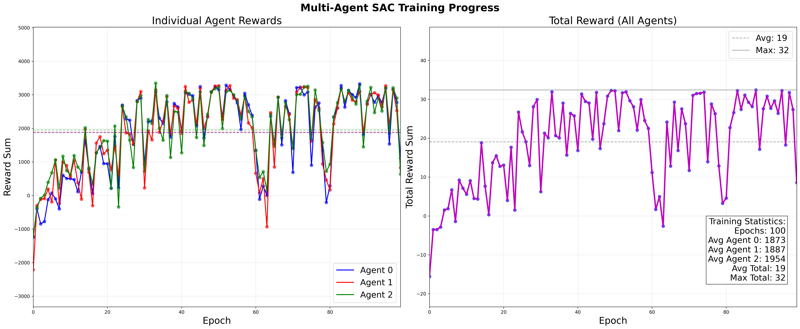

# Multi-Agent SAC (MASAC) LibTorch Implementation

This is an implementation of Multi-Agent Soft Actor-Critic (MASAC) algorithm using the C++ API of PyTorch (LibTorch). The implementation follows the Centralized Training with Decentralized Execution (CTDE) paradigm, where each agent has its own actor and critic networks, but training uses global state information.

## Features

- **Multi-Agent SAC**: Independent actor-critic networks for each agent
- **Centralized Training**: Critics use global state and joint actions
- **Decentralized Execution**: Each agent acts based on local observations
- **LibTorch Backend**: High-performance C++ implementation
- **Cooperative Environment**: Simple multi-agent navigation task

## Environment

The multi-agent environment features:
- 3 agents navigating in a 2D space
- Each agent has individual goals to reach
- Rewards based on distance reduction and goal achievement
- Shared termination conditions
- Wait for others when arrived

<figure>
  <p align="center"></p>
 <figcaption style="text-align:center;">Fig. 1: The agent in training mode (epoch = 50)</figcaption>
</figure>


## Project Structure

```
masac_libtorch/
├── Models.h                    # Actor and Critic network definitions
├── MultiSoftActorCritic.h      # MASAC algorithm implementation
├── MultiAgentEnvironment.h     # Multi-agent environment
├── ReplayBuffer.cpp            # Experience replay buffer
├── TrainSAC.cpp                # Main training script
├── plot_reward.py              # Reward visualization script
└── data/                       # Training logs and results
    ├── ma_epoch_rewards.txt    # Per-epoch reward statistics
    └── ma_independent_q.csv    # Detailed training logs
└── img                         # Store figures
```
## Network Architecture

#### Actor Network
```
Input (local_obs_dim) → FC(64) → ReLU → FC(64) → ReLU → [Mean, LogStd] → Tanh
```

#### Critic Network
```
Input (global_state + joint_action) → FC(64) → ReLU → FC(64) → ReLU → Q-value
```

## Build
You first need to install PyTorch. For a clean installation from Anaconda, checkout this short [tutorial](https://gist.github.com/mhubii/1c1049fb5043b8be262259efac4b89d5), or this [tutorial](https://pytorch.org/cppdocs/installing.html), to only install the binaries.

Do
```shell
mkdir build
cd build
cmake ..
make
```
Please note that you may need to modify the paths to **libtorch** and **eigen3** as well as the type of compiler.

## Run
Run the executable with
```shell
cd build
./train_sac
```

## Output Files

- `data/ma_epoch_rewards.txt`: Per-epoch reward statistics for each agent and total
- `data/ma_independent_q.csv`: Detailed step-by-step training logs
- `masac_rewards_split.png`: Generated reward visualization plots

## Visualization
To plot the results, run
```shell
python multiplot.py --csv_file data/ma_independent_q.csv --epochs 50 --output_path img --output_file ma --fps 15
```
It should produce something like shown below.

<figure>
  <p align="center"></p>
  <figcaption>Fig. 2: From left to right, the agent for successive epochs in training mode as it takes actions in the environment to reach the goal. </figcaption>
</figure>


To plot the rewards, run
```shell
python plot_reward.py
```

<figure>
  <p align="center"></p>
 <figcaption style="text-align:center;">Fig. 3: Training reward curves showing individual agent performance (left) and total team reward (right)</figcaption>
</figure>


## References
- [Soft Actor-Critic](https://arxiv.org/abs/1801.01290) - Original SAC paper
- [Multi-Agent DDPG](https://arxiv.org/abs/1706.02275) - MADDPG foundation
- [PyTorch C++ API](https://pytorch.org/cppdocs/) - LibTorch documentation

## Related Implementations

- **Single-Agent SAC**: https://github.com/YiOuO/sac_libtorch
- **PPO LibTorch**: https://github.com/mhubii/ppo_libtorch
- **TD3 LibTorch**: https://github.com/hrshl212/TD3-libtorch